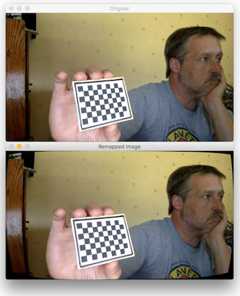

# robovision

Vision processing scripts useful for FIRST robotics teams and probably other purposes.

License: MIT

Author: Tim Poulsen, mentor for Team 1518 Raider Robotics

## Scripts

* auto_calibrate.py - camera calibration utility, uses the OpenCV chessboard technique to determine lens parameters to be used for dewarping operations
* imagetools.py - a class implementing a set of image adjustment and correction functions

## auto_calibrate.py &mdash; Camera calibration utility

1. Takes a still image every X seconds. Prompts you with a countdown between each.
2. From the resulting images, selects N images, checking each in turn that it shows
   the checkboard.
3. From that set of stills, it calculates camera parameters and saves them to a
   pickled object for later use in undistortion operations.
4. Optionally, shows a preview of unwarping a random calibration photo using the
   calculated lens parameters

Usage: `python3 auto_calibrate.py [options]`

Optional parameters

* `-i num` = interval between captures, default `3`
* `-t num` = total number of photos to capture, default `40`
* `-n num` = min number of checkerboard photos to process, default `15`
* `-o string` = output dir for calibration images and pickled props, default `./auto_calibrate/`
* `-c (num|string)` = camera source, default is built-in webcam
* `-p (true|false)` = Dewarp a test image and display a preview, default `True`
* `-z (true|false)` = Skip image capture, just process previously captured calibration images, default `False`

Examples:

`python3 auto_calibrate.py -i 2 -n 20`

(capture 20 stills, one every 2 seconds)

`python3 auto_calibrate.py -o custom_folder`

(saved captured images and results to ./custom_folder)

`python3 auto_calibrate.py -o custom_folder -z true`

(process photos already captured and stored in custom_folder)



(Note to self: don't look so bored next time! :smile:)

### Usage of the resulting pickle file

The imagetools.py class offers a `flatten()` method that will undistort an image taken with the same camera.

That class implements basically the following code:

```python
import pickle
camera_params = pickle.load(open('filename', "rb"))

# camera_params will be a dict with keys: mtx, dist, newcameramtx,
# mean_accuracy which you will feed to the cv2 functions

def flatten(img, params):
    h, w = img.shape[:2]
    newcameramtx, roi = cv2.getOptimalNewCameraMatrix(params['mtx'], params['dist'], (w, h), 1, (w, h))
    return cv2.undistort(img, params['mtx'], params['dist'], None, newcameramtx)

orig = cv2.imread('myimage.jpg')
flattened = flatten(orig, camera_params)

```

## Image tools class

Image adjustment and manipulation tools

Example use:

```
from imagetools import *

image_tools = ImageTools('camera_params.pickle')
image = cv2.imread('bot_picture.jpg')
flattened = image_tools.flatten(image)
```

Class/instance functions:

* `flatten()` - correct lens distortions in an image
* `equalize_lab()` - image equalization (contrast enhancement)
* `equalize_yuv()` - image equalization (contrast enhancement)
* `adjust_contrast()` - contrast/brightness adjustment
* `detect_edges()` - perform edge detection on an image

