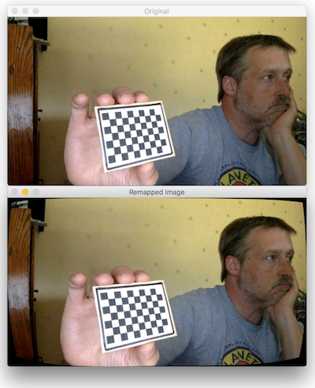

# auto_calibrate.py &mdash; Camera calibration utility

1. Takes a still image every X seconds. Prompts you with a countdown between each.
2. From the resulting images, selects N images, checking each in turn that it shows
   the checkboard.
3. From that set of stills, it calculates camera parameters. It prints these to the console
   in a form that you can copy & paste into your code. It also saves them to a pickled object
   for later use in undistortion operations.
4. Optionally, shows a preview of unwarping a random calibration photo using the
   calculated lens parameters

Usage: `python3 auto_calibrate.py [options]`

Optional parameters

* `-i num` = interval between captures, default `3`
* `-t num` = total number of photos to capture, default `40`
* `-n num` = min number of checkerboard photos to process, default `15`
* `-o string` = output dir for calibration images and pickled props, default `./auto_calibrate/`
* `-c (num|string)` = camera source, default is built-in webcam
* `-p (true|false)` = Dewarp a test image and display a preview, default `True`
* `-z (true|false)` = Skip image capture, just process previously captured calibration images, default `False`

Examples:

`python3 auto_calibrate.py -i 2 -n 20`

(capture 20 stills, one every 2 seconds)

`python3 auto_calibrate.py -o custom_folder`

(saved captured images and results to ./custom_folder)

`python3 auto_calibrate.py -o custom_folder -z true`

(process photos already captured and stored in custom_folder)



(Note to self: don't look so bored next time! :smile:)

# Usage of the resulting pickle file

The imagetools.py class offers a `flatten()` method that will undistort an image taken with the same camera.

That class implements basically the following code:

```python
import pickle
import robovision as rv

# You'll need this "object" class in order to de-pickle the camera
# parameters file
class Object(object):
    pass

vs = rv.VideoStream(source="webcam", cam_id=0)

# camera_params will be a dict with keys: mtx, dist, img_size,
# which you will feed to the Robovision flatten function
camera_params = rv.load_camera_params('params.pickle')

frame = vs.read_frame()
cv2.imshow("Original", frame)
frame = rv.flatten(frame, camera_params.mtx, camera_params.dist)
cv2.imshow("Flattened", frame)
cv2.waitKey(0)

```
